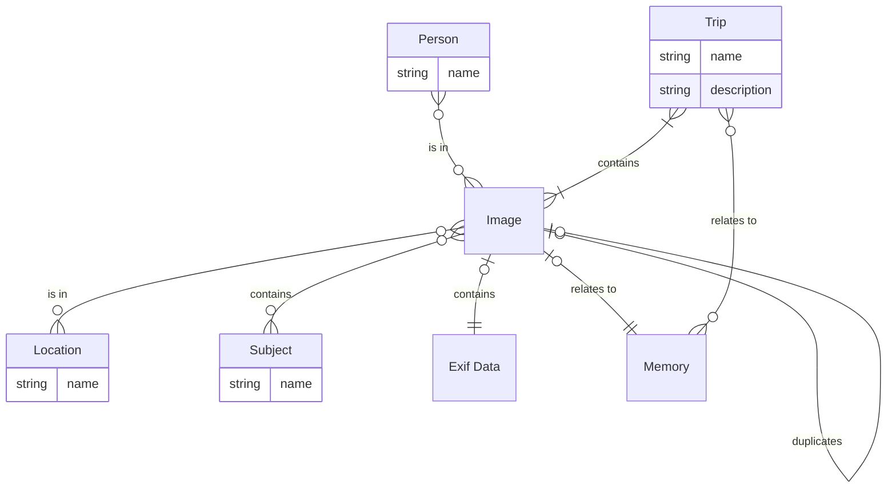
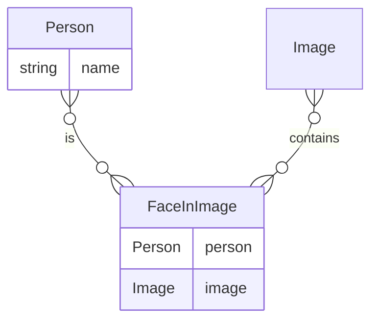
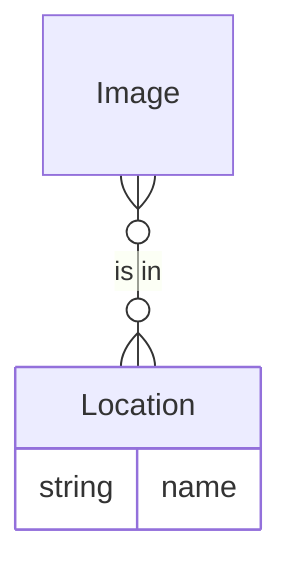
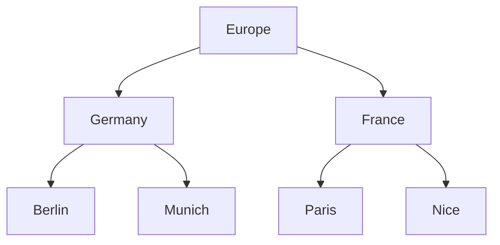
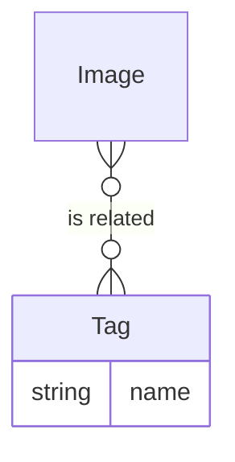
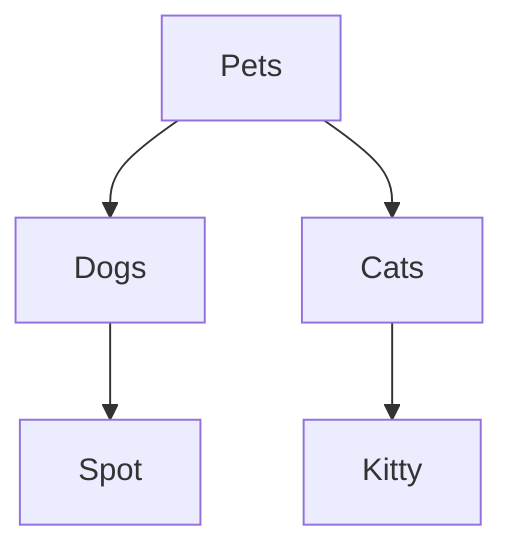

# Architecture

## API Routes

### Images

## Data Relationships

The basic unit of information is an Image. All other metadata is tied to or related
to an Image.

### Image to Person

Arguably the most important relationship, an Image may be related to zero or more Persons, through a face box in the image file metadata. A Person is
defined as someone with a name, and likely is related to one of the users. The Person is usually linked to an Image when they are one of the subjects visible in the Image.

Face bounding boxes and name (if possible) are synced to the image file using the [Metadata Working Group](https://exiftool.org/TagNames/MWG.html) `RegionInfo` key.

### Image to Location

An Image may be related to zero or more Locations. A Location is defined as a named place, which may be
as generic or specific as a user desires. Locations must be unique, but may be as specific or general as users desire.

Locations are also hierarchical, allowing a tree to be built from least to most specific. This is particularly useful as slides may only contain a general idea of where they were taken, but some images
may be recognizable locations which can be narrowed to a city or even part of a city.

For example:

Locations are synced to XMP tags using the Metadata Working Group `HierarchicalKeywords` key. It is recommended, but not required to create one root location, but convention named "Location" to differentiate between a Location and a Tag

### Image to Tag

An Image may be related to zero or more Tags. Tags llowing descriptive labels to be applied to an Image for locating similar images and general grouping.

For example:

Tags are synced to XMP tags using the Metadata Working Group `HierarchicalKeywords` key.

### Image to Memory

An Image may be related to zero or more Memories. A Memory is a text description, voice memory or scanned document which encapsulates a memory about the image, such as recalling how a location was found, what the image is of or why it was taken. These help to contextualize Images and keep the most irreplaceable thing of old pictures around, the memories of those who actually were there.

### Trip to Image

A Trip may be related to one or more Images. This is a grouping to allow combining related Images into a sorted ordering, all taken while on the same trip or vacation.

### Trip to Memory

An Trip may be related to zero or more Memories. A Memory is a text description, voice memory or scanned document which encapsulates a memory about the image, such as recalling how a location was found, what the image is of or why it was taken. Examples could include interviews with the photographer, diary entries and so on.

## Tasks

### Initial Consumption

### Checker

## Commands

### Indexer
